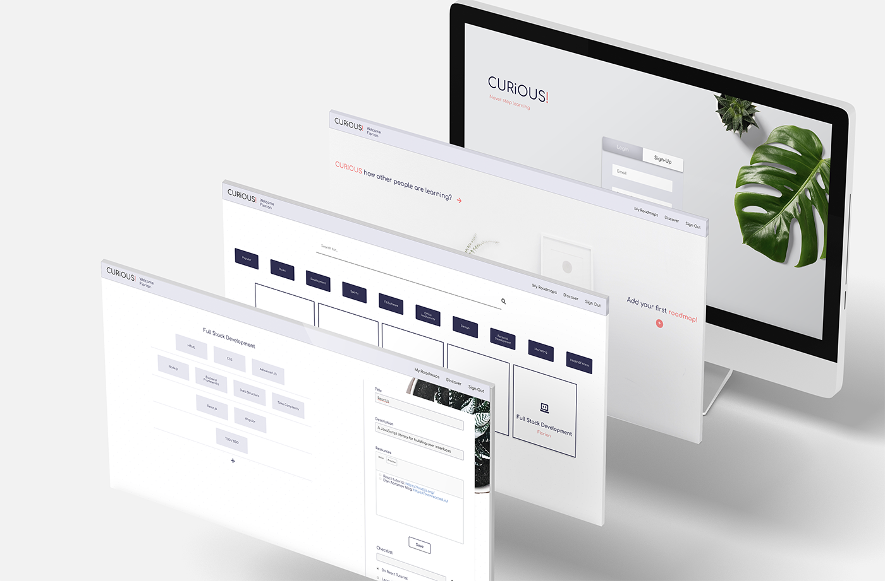

# Curious

Curious is a web app to help you structure, organize and create long-term plans for your self-learning goals.

## Screenshots



   
## Installation
To run the app please follow these instructions:

1. Clone the repository
```bash
git clone https://github.com/steelersbcn/curious-client
cd curious-client
```
2. Install the dependencies

```bash
npm install
```
## Get it started
In the root project folder *curious-client*:
```bash
npm start
```
## Tech Stack
* React
* Typescript
* Apollo Client
* Apollo Server
* GraphQL
* Sequelize ORM
* PostgreSQL

## Recommendation
Feel free to have a look at the server of this application: [Curious Server](https://github.com/steelersbcn/curious-server)

## Developers
* Andre Lellis Adnet Coutinho [LinkedIn](https://www.linkedin.com/in/andre-lellis-640495bb/) | [GitHub](https://github.com/andrelellis)
* Fábio Tiago Carneiro Videira [LinkedIn](https://www.linkedin.com/in/fabio-videira/) | [GitHub](https://github.com/Videiraft)
* Florian Jost [LinkedIn](https://www.linkedin.com/in/fjost/) | [GitHub](https://github.com/steelersbcn)
* Roberto Antunes [LinkedIn](https://www.linkedin.com/in/robm-antunes/) | [GitHub](https://github.com/RobAntunes)
